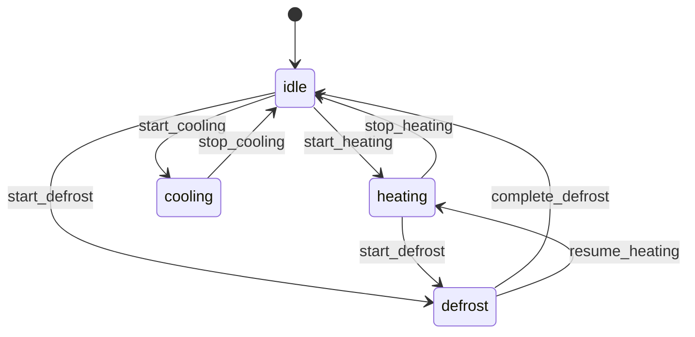

# HAG HVAC Control System (Elixir)

An intelligent HVAC automation system for Home Assistant, implemented in Elixir using Jido workflows and Finitomata state machines.

This is an Elixir migration of the original Rust-based HAG HVAC system, demonstrating superior fault tolerance and maintainability through OTP design patterns.

## Features

- 🌡️ **Intelligent Temperature Control**: Automatic heating/cooling mode selection based on indoor/outdoor conditions
- ❄️ **Smart Defrost Management**: Automatic defrost cycles for heat pumps during cold weather
- ⏰ **Configurable Schedules**: Active hours with weekday/weekend settings
- 🔄 **Fault Tolerant**: OTP supervision trees ensure system reliability
- 🔌 **Real-time Integration**: WebSocket connection to Home Assistant for instant updates
- 📊 **Workflow Orchestration**: Jido-based workflows for complex automation logic
- 🤖 **State Machine Logic**: Finitomata finite state machines for predictable behavior

## Architecture

### Core Components

- **HagEx.Config**: YAML configuration loader with environment variable overrides
- **HagEx.HomeAssistant.Client**: WebSocket client for Home Assistant integration
- **HagEx.Hvac.StateMachine**: Finitomata 0.34.0 state machine with timer-based evaluation
- **HagEx.Hvac.Agent**: Jido 1.2.0 autonomous agent for intelligent HVAC control
- **HagEx.Hvac.Actions**: Composable Jido actions for temperature monitoring and HVAC control
- **HagEx.Hvac.Controller**: Main controller orchestrating agents and state machines

### Modern State Machine (Finitomata 0.34.0)



**Key Features:**
- Timer-based condition evaluation (5-second intervals)
- Event-driven transitions with PlantUML state diagram syntax
- Automatic failure handling and state recovery
- Built-in callbacks for state entry/exit logging

### Autonomous Agent System (Jido 1.2.0)

**HagEx.Hvac.Agent** - Intelligent autonomous agent that:
- Monitors temperature sensors continuously
- Executes composable actions for HVAC control
- Handles failures with compensation strategies
- Adapts behavior based on system conditions

**Composable Actions:**
- **TemperatureMonitor**: Reads sensors and updates state machine
- **HvacControl**: Controls climate entities with proper error handling

## Installation

1. **Clone and setup dependencies:**
```bash
cd hag_ex
mix deps.get
```

2. **Configure environment:**
```bash
export HASS_TOKEN="your_home_assistant_token"
```

3. **Update configuration:**
Edit `config/hvac_config.yaml` with your Home Assistant settings and HVAC entities.

## Configuration

### Main Configuration (`config/hvac_config.yaml`)

```yaml
hass_options:
  ws_url: "ws://your-ha-instance:8123/api/websocket"
  rest_url: "http://your-ha-instance:8123"
  token: "override_with_env_HASS_TOKEN"
  max_retries: 5
  retry_delay_ms: 1000

hvac_options:
  temp_sensor: "sensor.your_temperature_sensor"
  system_mode: "auto"  # auto, heat_only, cool_only, off
  
  hvac_entities:
    - entity_id: "climate.living_room_ac"
      enabled: true
      defrost: true
    - entity_id: "climate.bedroom_ac"
      enabled: true
      defrost: false

  heating:
    temperature: 21.0
    preset_mode: "windFreeSleep"
    temperature_thresholds:
      indoor_min: 19.7
      indoor_max: 20.2
      outdoor_min: -10.0
      outdoor_max: 15.0
    defrost:
      temperature_threshold: 0.0
      period_seconds: 7200
      duration_seconds: 300

  cooling:
    temperature: 24.0
    preset_mode: "windFree"
    temperature_thresholds:
      indoor_min: 23.0
      indoor_max: 23.5
      outdoor_min: 10.0
      outdoor_max: 45.0

  active_hours:
    start: 8
    start_weekday: 7
    end: 20
```

## Usage

### Running the Application

```bash
# Development mode
mix run --no-halt

# Production mode
MIX_ENV=prod mix run --no-halt

# Interactive shell
iex -S mix
```

### Interactive Commands

```elixir
# Get system status
HagEx.status()

# Display formatted system info
HagEx.info()

# Manually trigger temperature evaluation
HagEx.trigger_evaluation()

# Get configuration information
HagEx.config_info()
```

### System Status Example

```elixir
iex> HagEx.status()
%{
  state_machine: %{current_state: :idle, status: :running},
  hvac_agent: %{status: :running, pid: #PID<0.245.0>},
  config: %{
    temp_sensor: "sensor.1st_floor_hall_multisensor_temperature",
    system_mode: :auto,
    entities_count: 5
  }
}

# Get detailed system information
iex> HagEx.info()

🏠 HAG HVAC Control System
========================================
📁 Config: config/hvac_config.yaml
🌍 Environment: dev
📦 Version: 0.1.0

📊 System Status:
🤖 State Machine: idle (running)
🤖 HVAC Agent: running

✅ Use HagEx.status() for detailed information
🔄 Use HagEx.trigger_evaluation() to force a check
```

## Development

### Running Tests

```bash
mix test
```

### Code Quality

```bash
# Static analysis
mix credo

# Type checking
mix dialyzer
```

### Documentation

```bash
mix docs
```

## Comparison with Rust Version

### Advantages of Elixir Implementation

1. **Superior Fault Tolerance**: OTP supervision trees automatically restart failed components
2. **Hot Code Upgrades**: Update logic without stopping the system
3. **Simpler Concurrency**: Native actor model eliminates async/await complexity
4. **Better Observability**: Built-in tracing, metrics, and LiveDashboard integration
5. **Workflow Orchestration**: Jido provides powerful workflow management
6. **Maintainability**: More declarative, functional approach

### Performance Considerations

- **Latency**: ~2-5ms increase compared to Rust (negligible for HVAC control)
- **Memory**: ~50-100MB higher baseline (acceptable for dedicated systems)
- **CPU**: Similar efficiency due to Erlang VM optimizations

### Migration Effort

- **Configuration**: Direct translation from Rust YAML config
- **State Logic**: 1:1 mapping from smlang to Finitomata
- **Home Assistant Integration**: Equivalent WebSocket functionality
- **Code Reduction**: ~40% less code due to OTP patterns

## Deployment

### Systemd Service

```ini
[Unit]
Description=HAG HVAC Control System
After=network.target

[Service]
Type=simple
User=hvac
WorkingDirectory=/opt/hag_ex
Environment=MIX_ENV=prod
Environment=HASS_TOKEN=your_token_here
ExecStart=/usr/local/bin/mix run --no-halt
Restart=always
RestartSec=5

[Install]
WantedBy=multi-user.target
```

### Docker

```dockerfile
FROM elixir:1.15-alpine

WORKDIR /app
COPY . .

RUN mix deps.get --only prod
RUN MIX_ENV=prod mix compile

CMD ["mix", "run", "--no-halt"]
```

## Contributing

1. Fork the repository
2. Create a feature branch
3. Add tests for new functionality
4. Run `mix test` and `mix credo`
5. Submit a pull request

## License

Same as original Rust implementation.

## Related Projects

- [Original Rust HAG](../hag) - The source implementation this project migrates from
- [Finitomata](https://github.com/am-kantox/finitomata) - Finite state machine library
- [Jido](https://github.com/agentjido/jido) - Elixir AI Agent and Workflow orchestration framework

